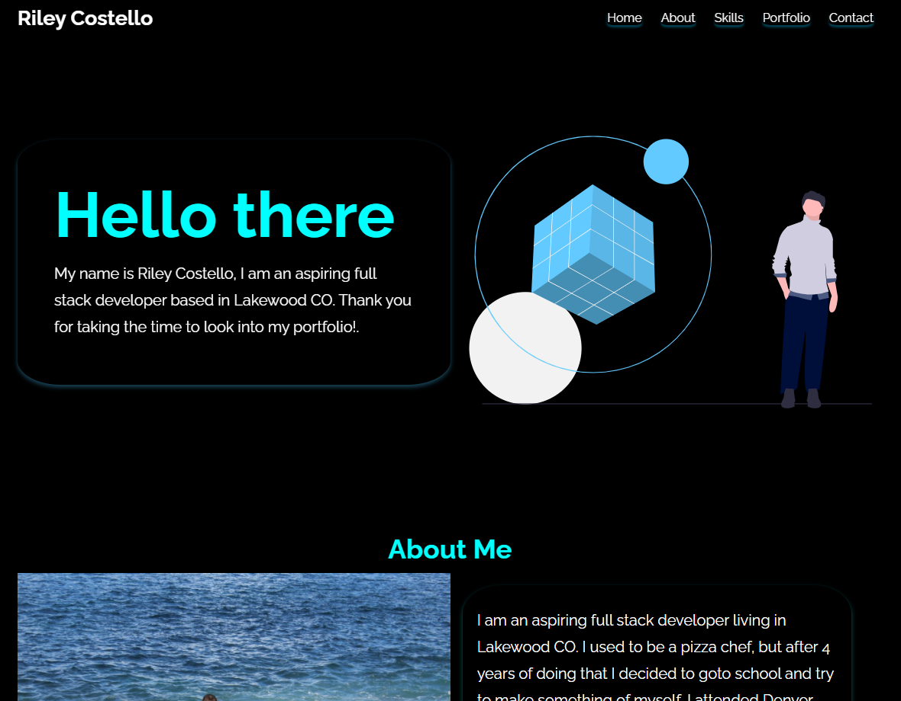

# React Portfolio

## License Info

This is licensed with No License

## Description

This is my most up to date portfolio displaying my favorite assignments throughout the course of my time at the coding bootcamp.

## Table of Contents

- [Installation](#installation)
- [Use](#use)
- [Tests](#tests)
- [Contributors](#contributors)

## Installation/Technologies used:

react, node, ract animations.

## visual

## link to deployed application

https://milagro12090.github.io/Portfolio-4.0/

## Tests

localhost

## Contact for contributers

phone or email

## My Contact Info

Milagro12090
rileytcostello@gmail.com
